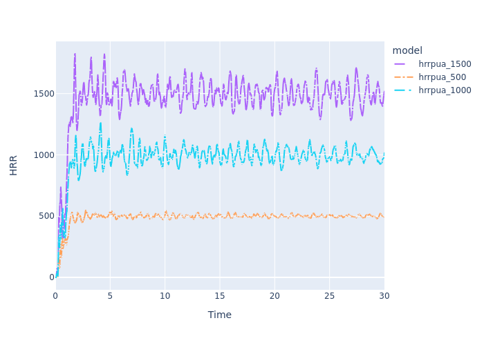

# HRRPUA

This model is intended to demonstrate how to use xFDS to calculate variables such as `HRRPUA`.

## Inputs

This example automatically calculates the `HRRPUA` parameter and `XB` bounds for different fire sizes on a 1.5 m2 burner. In `hrrpua.fds`, you will see

- `top` is set so that the &VENT always sits on the top of the &OBST. Updating the variable will set the `zmin` and `zmax` for the &VENT as well as the `zmax` for the &OBST.
- `area` is defined in the metadata, but the length of a `side` (for a square burner) is calculated in the template.
- `r` (radius) is defined to be half the length of a side. This helps define the `XB` so the burner is perfectly centered regardless of the area.
- `HRRPUA` is calculated based on the `hrr` and `area` variables defined. This way `HRRPUA` is always correct if `hrr` is updated.
- The `XB` parameters use `r`, `top`, and `depth` to ensure the burner is centered and that the &VENT always aligns with &OBST.

The `hrrpua.yaml` configuration file specifies three different fire sizes. The model name is defined as `hrrpua_{{hrr}}` which sets the folder and file names for the output so they include the `hrr` for that model.

## Outputs

To demonstrate that this is working correctly, the HRR curves are plotted together.

